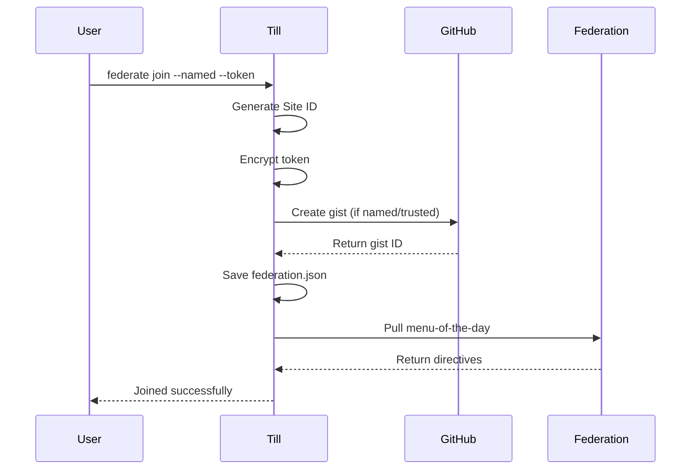
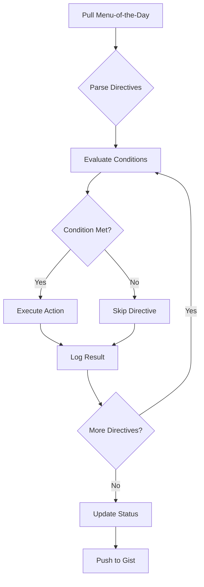

# Till Federation Architecture

## Overview

The Till Federation is designed as a decentralized, asynchronous system using GitHub as infrastructure for coordination and communication between Till installations worldwide.

## Core Concepts

### 1. Federation Identity

Each Till installation has a unique Site ID generated upon joining:

```
Format: {hostname}-{timestamp}-{random}
Example: M4-1757943273-6807
```

This ID is:
- **Unique**: Combination ensures no collisions
- **Persistent**: Survives across sessions
- **Anonymous**: Reveals minimal information

### 2. Trust Model

```
┌─────────────────────────────────────────┐
│            Trust Levels                  │
├─────────────────────────────────────────┤
│                                         │
│   Anonymous ──► Named ──► Trusted      │
│      │           │          │          │
│   No Token   GitHub     GitHub +       │
│   No Gist    Token      Telemetry     │
│   Read-only  + Gist     + Priority    │
│                                        │
└────────────────────────────────────────┘
```

### 3. Communication Channels

#### Menu-of-the-Day (Repository → Till)
- **Source**: `till/federation/menu-of-the-day.yaml`
- **Direction**: One-way broadcast
- **Frequency**: Daily updates
- **Content**: Directives, updates, announcements

#### Status Gists (Till → Repository)
- **Source**: Individual Till installations
- **Direction**: One-way reporting
- **Frequency**: On-demand or scheduled
- **Content**: Status, health, telemetry

## Data Structures

### Federation Configuration

```json
{
  "site_id": "M4-1757943273-6807",
  "gist_id": "a1b2c3d4e5f6",
  "github_token_encrypted": "encrypted_token_here",
  "trust_level": "named",
  "last_sync": 1757943273,
  "auto_sync": true,
  "last_menu_date": "2025-01-15"
}
```

### Menu-of-the-Day Format

```yaml
# federation/menu-of-the-day.yaml
version: 1
date: 2025-01-15
expires: 2025-01-16
directives:
  - id: directive-001
    type: update|security|feature|announcement
    priority: low|normal|high|critical
    condition: "expression"
    action: "command"
    metadata:
      author: "system"
      reason: "description"
      rollback: "command"
```

### Status Gist Format

```json
{
  "site_id": "M4-1757943273-6807",
  "timestamp": 1757943273,
  "trust_level": "named",
  "till_version": "1.5.0",
  "status": {
    "installations": 5,
    "last_sync": "2025-01-15T09:30:00Z",
    "directives_processed": 45,
    "health": "healthy"
  },
  "telemetry": {
    "enabled": false,
    "data": {}
  }
}
```

## Workflows

### 1. Federation Join Sequence



### 2. Directive Processing Flow



### 3. Synchronization Process

```
┌──────────────┐     ┌──────────────┐     ┌──────────────┐
│    Pull      │────►│   Process    │────►│    Push      │
│              │     │              │     │              │
│ - Menu fetch │     │ - Conditions │     │ - Status     │
│ - Directive  │     │ - Actions    │     │ - Telemetry  │
│   download   │     │ - Logging    │     │ - Metrics    │
└──────────────┘     └──────────────┘     └──────────────┘
```

## Implementation Details

### File Locations

```
~/.till/
├── federation.json          # Global federation config
├── logs/
│   └── federation_*.log     # Federation activity logs
└── cache/
    └── menu_*.yaml          # Cached menu-of-the-day

/path/to/till/
├── src/
│   ├── till_federation.c    # Core federation logic
│   └── till_federation.h    # Federation definitions
└── docs/
    └── federation/          # Federation documentation
```

### API Endpoints

#### GitHub Gist API
```
POST   /gists                 # Create gist
GET    /gists/{id}            # Get gist
PATCH  /gists/{id}            # Update gist
DELETE /gists/{id}            # Delete gist
```

#### Repository Menu Endpoint
```
GET /ckoons/till/main/federation/menu-of-the-day.yaml
```

### Condition Language

Directives use a simple condition language:

```
# Version checks
version < 1.5.0
version >= 1.4.0
version == 1.5.0

# Trust level checks
trust_level == anonymous
trust_level == named
trust_level == trusted

# Installation checks
installations > 5
has_component("tekton")

# Combination
version < 1.5.0 && trust_level == trusted
platform == "mac" || platform == "linux"
```

### Action Types

```bash
# Update actions
till update
till sync
till install <component>

# Configuration actions
set_config key value
enable_feature <feature>
disable_feature <feature>

# Maintenance actions
cleanup_logs older_than:7d
repair_registry
optimize_cache

# Security actions
apply_patch <patch_file>
rotate_keys
verify_integrity
```

## Security Model

### Token Security
- Tokens encrypted locally (currently XOR, needs improvement)
- Never transmitted except to GitHub API
- Stored in user-only readable file (0600 permissions)

### Directive Validation
- All directives signed (future)
- Conditions evaluated locally
- Actions sandboxed (future)
- Rollback capability

### Privacy Levels

| Trust Level | Data Shared | Privacy |
|------------|-------------|---------|
| Anonymous | None | Complete |
| Named | Status, version, counts | Moderate |
| Trusted | Full telemetry | Limited |

## Performance Considerations

### Caching Strategy
- Menu-of-the-day cached for 24 hours
- Gist updates throttled to once per hour
- Directive results cached to prevent re-execution

### Network Efficiency
- Single HTTPS request for menu pull
- Batch gist updates when possible
- Compress telemetry data (future)

### Resource Usage
- Minimal CPU: Condition evaluation only
- Low memory: < 1MB for federation data
- Disk: < 10MB for logs and cache

## Failure Modes

### Network Failures
- **Pull fails**: Use cached menu if available
- **Push fails**: Queue for later retry
- **Token invalid**: Downgrade to anonymous

### Data Corruption
- **Config corrupt**: Prompt to rejoin
- **Cache corrupt**: Clear and re-fetch
- **Gist inaccessible**: Create new gist

### Recovery Procedures
```bash
# Repair federation
till federate repair

# Reset to clean state
till federate reset

# Export/import config
till federate export > backup.json
till federate import backup.json
```

## Future Enhancements

### Phase 1: Core Implementation
- [x] Basic join/leave/status commands
- [x] Trust level support
- [x] Global configuration
- [ ] GitHub API integration
- [ ] Menu-of-the-day fetching
- [ ] Directive processing

### Phase 2: Enhanced Features
- [ ] Proper encryption for tokens
- [ ] Directive signing and validation
- [ ] Telemetry collection
- [ ] Peer discovery
- [ ] Federation statistics dashboard

### Phase 3: Advanced Capabilities
- [ ] Bidirectional communication
- [ ] Distributed directive voting
- [ ] Automatic trust elevation
- [ ] Federation-wide alerts
- [ ] Collaborative debugging

## Testing Strategy

### Unit Tests
- Site ID generation
- Condition evaluation
- Token encryption/decryption
- Config persistence

### Integration Tests
- GitHub API interaction
- Menu fetching and parsing
- Gist creation and updates
- Directive execution

### End-to-End Tests
- Complete join/sync/leave cycle
- Trust level progression
- Multi-directive processing
- Error recovery scenarios

## Monitoring and Metrics

### Health Indicators
- Last successful sync time
- Directive success rate
- Network connectivity status
- Token validity

### Federation Metrics
- Total members by trust level
- Daily active installations
- Directive adoption rates
- Geographic distribution

### Alerting Thresholds
- No sync for > 7 days
- Directive failure rate > 10%
- Token expiration warning
- Security patch not applied

## Compliance and Governance

### Data Retention
- Logs: 30 days local
- Gists: Indefinite (user controlled)
- Telemetry: 90 days (when implemented)

### Privacy Policy
- Anonymous: No data collection
- Named: Minimal status only
- Trusted: Explicit consent required

### Terms of Service
- Free for all users
- No warranty provided
- User responsible for directive execution
- Respect GitHub API limits